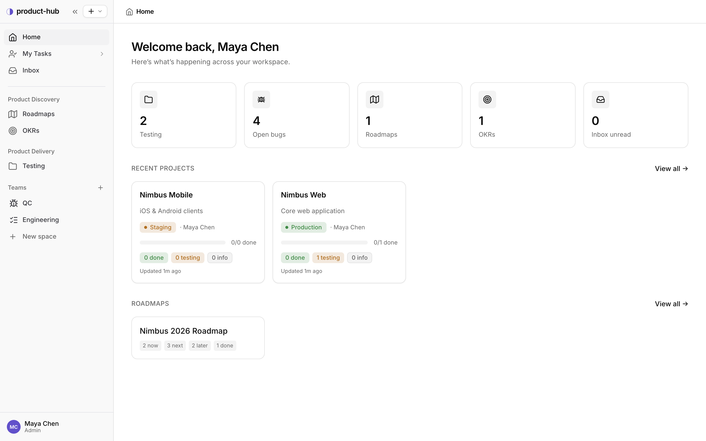
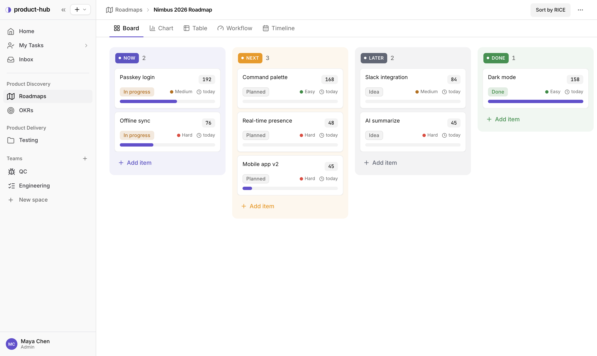
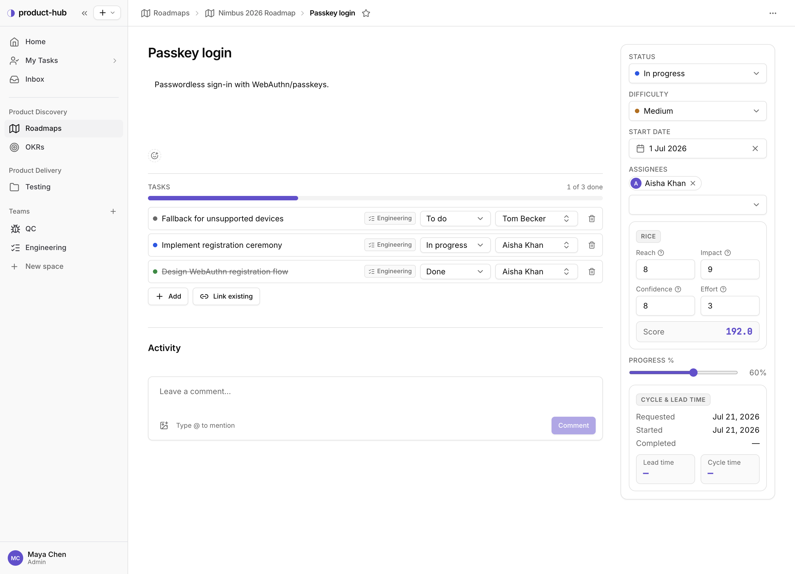
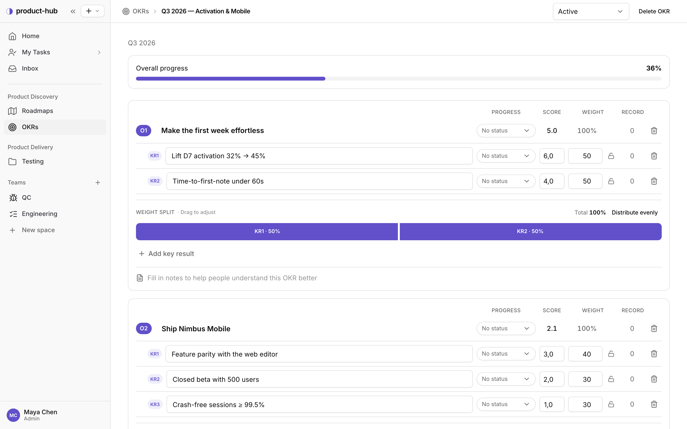
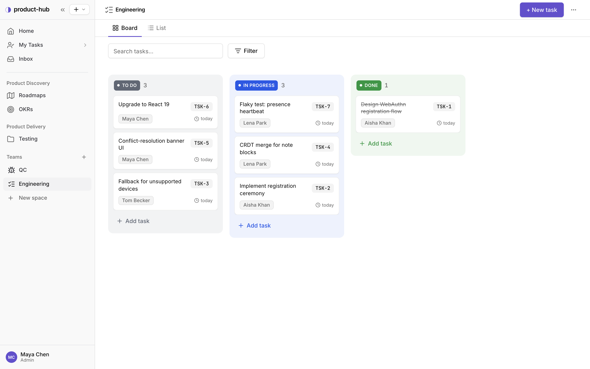
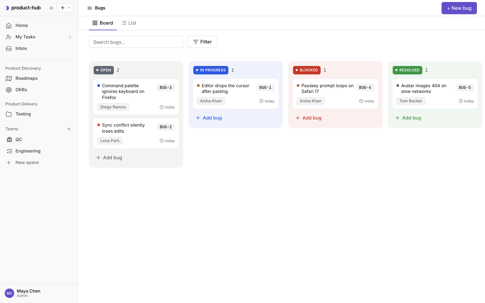
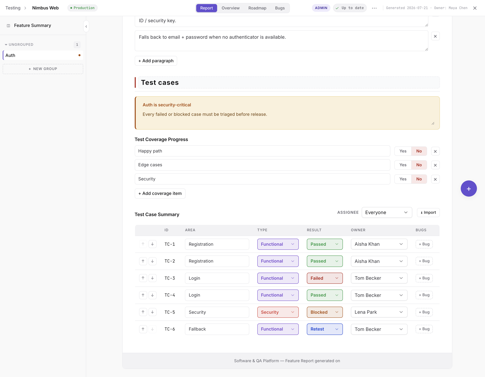
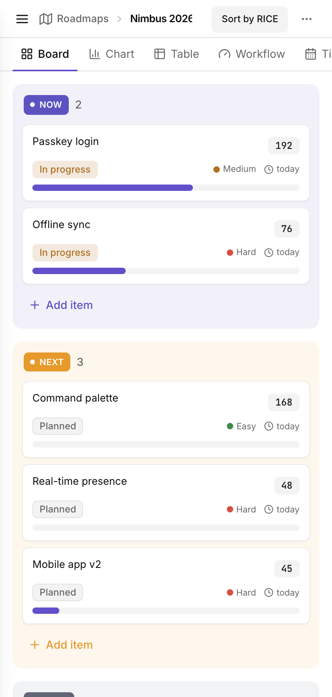

<div align="center">

# product-hub

### The product team's operating system — from discovery to delivery, in one workspace.

Plan what to build, decide what matters, ship it, and prove it works —
without stitching together Jira, Confluence, a spreadsheet, and Notion.



</div>

---

## Why product-hub

Most teams scatter the product loop across five tools: a roadmap in one place, tasks
in another, bugs in a third, test evidence in a spreadsheet, and OKRs in a doc nobody
opens. The context lives in the gaps between them.

**product-hub keeps the whole loop in one place** and *connects* the pieces:

> **Discover** what to build → **prioritize** with RICE → **align** on OKRs →
> **execute** on team boards → **catch** bugs → **prove** it works with test cases.

Because everything is structured (not free-form docs), the app computes the rollups a
wiki can't: RICE scores, OKR progress, "N of M done", test coverage, cycle & lead time.

---

## What's inside

### 🗺️ Roadmaps with RICE prioritization

Now / Next / Later / Done boards where every item carries a **RICE score** (Reach ×
Impact × Confidence ÷ Effort), a status, difficulty, and a progress bar. Sort the whole
board by RICE to see what actually deserves the next sprint — and switch to Chart, Table,
Workflow, or Timeline views of the same data.



### 🎯 Item detail — score it, break it down, track it

Open any roadmap item to tune its RICE inputs, assign owners, and break the work into
**tasks that roll up** into a "1 of 3 done" bar. Cycle & lead time are tracked
automatically from the moment work starts.



### 📌 OKRs that roll up on their own

Objectives → Key Results with **drag-to-adjust weights**. Move a key result's progress
and watch its objective — and the overall milestone — recompute in real time. No more
quarterly OKR spreadsheet math.



### ✅ Team boards for execution

Each team (Engineering, QC, …) gets its own Kanban board with its own statuses. Tasks
carry assignees, estimates, due dates, and short IDs (`TSK-7`) — and a task created under
a roadmap item stays linked to it.



### 🐞 Bug tracking with severity & workflow

A dedicated Kanban for bugs — Open / In Progress / Blocked / Resolved / Closed — with
severity dots, assignees, short IDs (`BUG-3`), search, and filters. Statuses are
configurable per team.



### 🧪 Test cases as living evidence

Every feature gets a structured report: an overview, a coverage summary, and a
**test-case table** with color-coded results — Passed, Failed, Blocked, Retest. Import
cases from a spreadsheet, or let CI tick results through the public API. This is the
"does it actually work?" half a wiki can't give you.



---

## Works on every screen

Every board, form, and detail view is fully responsive — the same roadmap, stacked for a
phone.

<div align="center">

</div>

---

## Roles & permissions

Five roles, enforced on both the API and the UI:

| Role | Can do |
|---|---|
| **Admin** | Everything — manage people, workspace settings, delete roadmaps & OKRs. |
| **Product** | Create/edit roadmaps & OKRs, manage delivery, assign work. |
| **Tester** | Edit planning content and delivery work items (tasks, bugs, test cases). |
| **Developer** | Maintain delivery work items only. |
| **Guest** | Read-only — plus unguessable public links for stakeholders. |

---

## Tech stack

| Layer | Built with |
|---|---|
| **Frontend** | React + TypeScript, Vite, Tailwind CSS, Radix UI (shadcn-style), TanStack Query, React Router |
| **Backend** | NestJS 11, MongoDB (Mongoose), JWT auth, class-validator, Swagger |
| **Tooling** | Docker Compose (MongoDB), one-command dev script |

---

## Run it locally

**Prerequisites:** Node.js 20+, and Docker (for MongoDB — or bring your own on `:27017`).

```bash
git clone <your-repo-url> product-hub
cd product-hub
./dev.sh
```

`./dev.sh` copies the example `.env` files, installs dependencies on first run, starts
MongoDB, and boots both servers:

| | URL |
|---|---|
| **App** | http://localhost:3001 |
| **API** | http://localhost:3000/v1 |
| **API docs (Swagger)** | http://localhost:3000/swagger |

Already have MongoDB running? Skip Docker with `SKIP_DB=1 ./dev.sh`.

Open the app, **register** a workspace, and you're in as its admin.

---

## Project layout

```
product-hub/
├── frontend/     React + Vite SPA (features/, components/ui abstraction layer)
├── backend/      NestJS API (DDD: presentation / application / infrastructure)
├── docs/         Product overview, architecture, roles, feature inventory
└── dev.sh        One-command local stack (Mongo + API + web)
```

More detail lives in [`docs/`](docs/) — start with
[`docs/01-product-overview.md`](docs/01-product-overview.md).

---

<div align="center">
<sub>Built to keep the product owner in control and the whole team on the same page.</sub>
</div>
